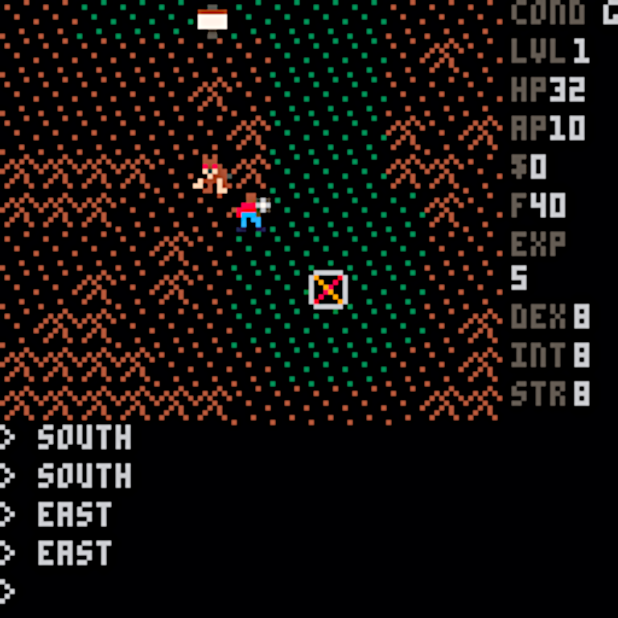
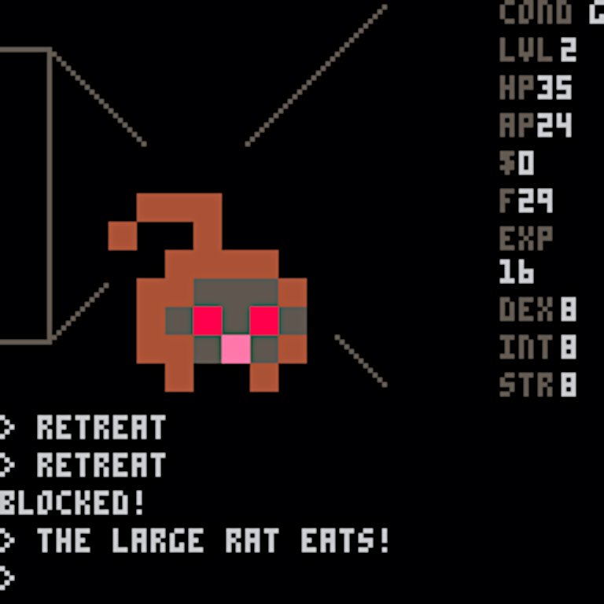
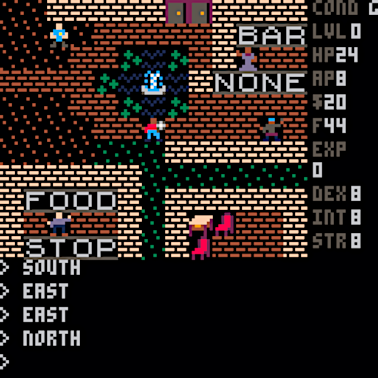

Anteform
========

*A retro weird detective game in the style of the 8-bit Ultima games.*

What Is It?
-----------

Anteform is a weird detective RPG in the style of the older `Ultima games`_ as played on
the Commodore 8-bit computers (although its plot will probably feel a bit more like
the Worlds of Ultima series). Just like the original Ultima games, it includes a world
view, enterable towns, and 3D dungeon displays. It also features graphics, sound
effects, and music that should help one recollect those classics. More importantly,
it is a fully playable (although not yet winnable) game with its own backstory, plot,
setting, and characters.

It was written using the Minima Engine for `PICO-8`_, and can be played online on the
`Anteform at Lexaloffle page`_ and available for download for Linux, macOS,
MS-Windows, and Raspberry Pi through the `Anteform Itch.io page`_.

Screenshot of the valley view in Anteform. There's a sign to the north, a coyote coming
down from the northwest, a helicopter pad to the southeast, and plains to the south and hills
all around.

Screenshot of the cave view in one of Anteform's mines. The player is trying to
retreat from a rat of unusual size (shown directly ahead), but has bumped into a wall. Uh-oh!

Screenshot of the settlement view in one of Anteform's villages. A fountain, merchant, bartender,
customer, and cop are all present.

What Is It About?
-----------------

Figuring this out is part of the game. You're a detective who's been called to Anteform
Valley to try and locate the missing Steve Johanson. His girlfriend Sally Franklin and
a few of the other townies pooled their resources to hire you, and they convinced the
supply helicopter to drop you off. "Supply helicopter" you ask? Yes, Anteform Valley is
a good distance in the mountains and largely cut off from the world. You won't have any
backup, and you'll quickly discover that this isn't a simple missing persons case.

It's up to you to figure out not just what happened to Steve, but what's going on in
the valley overall. It's up to you to stop it.

It's recommended that you try to get to the main village first. There you'll find both
Sally and the mayor. You start off without any weapons or armor, and this is a very
precarious situation to be in. You'll want to rectify it as quickly as possible. If
you've not done so yet, you should peruse the manual and get some tips about surviving
in Anteform Valley as well as basic information about game controls. If you are too
impatient to skim through the manual, the basic game controls are accessible from
within the pause menu of the game itself. Pressing the `p` key (or the `enter` key on
some platforms) should bring up this menu.

Relationship to Minima
----------------------

This was written using the Minima Engine and was deliberately made to use similar controls
whenever possible. If you are comfortable with one game you'll be comfortable with the
other, too. They aren't set in the same place, though, and while Minima is a large-scale
fantasy game with towns and castles set across a world, Anteform is a weird detective game
of more intimate scale with squares and buildings set across a valley. Anteform has no
magic, but definitely has sci-fi / horror elements that you'll discover on your own as
you progress through the story. It has no spells, but has some special actions that
provide similar (albeit weaker) effects. It has a bit less fighting than Minima, but
more talking, breaking & entering, and searching.

Minima can be downloaded from the `Minima Itch.io page`_ and its source code can be
downloaded from the `Minima GitHub page`_. It can be played online at the
`Minima at Lexaloffle page`_.

Supported Platforms
-------------------

Anteform will run everywhere that PICO-8 runs. By design it does not require the latest
& greatest version of PICO-8, so it'll even run on PocketC.H.I.P.

Challenges
----------

The constraints of building something within the PICO-8 environment make a project like
this fairly tough. This game pretty much maxes out PICO-8 capacity; there's not a
lot of space left and I'd likely have to trim out some already-present features to
shoehorn in anything else. All the PICO-8 graphic space (both for sprites and maps) are
fully used. All the sound effects slots are used. The final version here
is a careful balance between maxing out the token count and the compressed size. The raw
size is already too large to fit without minimization, too, and even with that many
manual tweaks are required making the code quite ugly in places.

Building Anteform
-----------------

Normally PICO-8 applications are written in a special dialect of Lua and are immediately
interpreted within the PICO-8 environment without any special build steps. Anteform is a
little larger and more complicated than most PICO-8 applications, and it is too large to
run directly without a special minimization step. The `picotool`_ utility does most of
what's needed, but at the moment unless this `special branch of picotool`_ is run with the
`luamin2` argument, it'll break Anteform.

Design Notes
------------

Anteform is mostly data-driven using the "Minima Engine". It uses a JSON data structure
to define the people, creatures, and objects, and another JSON data structure to define
all the maps and dungeons. Command sequencing uses coroutines in order to avoid
overly-complicated state machines.

Other Notes
-----------

This version makes use of a stripped-down version of Tyler Neylon's `json.lua`_ routine
to parse JSON data. The additional `Lua`_ utility script `convert.lua` is used to make it
easier to lay out a dungeon map and turn it into something the game can use.

.. _Anteform at Lexaloffle page: https://www.lexaloffle.com/bbs/?tid=35093
.. _Anteform Itch.io page: https://feneric.itch.io/anteform
.. _Minima Itch.io page: https://feneric.itch.io/minima
.. _Minima GitHub page: https://github.com/Feneric/Minima
.. _Minima at Lexaloffle page: https://www.lexaloffle.com/bbs/?tid=31831
.. _Ultima games: https://en.wikipedia.org/wiki/Ultima_(series)
.. _PICO-8: https://www.lexaloffle.com/pico-8.php
.. _picotool: https://github.com/dansanderson/picotool
.. _special branch of picotool: https://github.com/Feneric/picotool
.. _json.lua: https://gist.github.com/tylerneylon/59f4bcf316be525b30ab
.. _Lua: https://www.lua.org/docs.html
